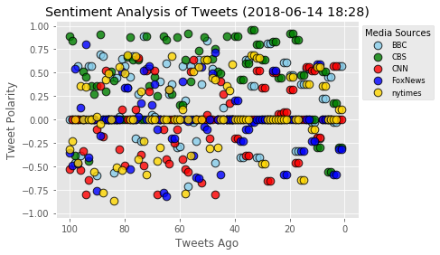

### News Mood

In this activity, we are going to review Tweepy.

BBC, CBS, CNN, Fox, and New York times
- - -


```python
# Dependencies
import numpy as np
import pandas as pd
import tweepy
import json
import time
from datetime import datetime
import matplotlib.pyplot as plt
from matplotlib import style
style.use('ggplot')
from config import (consumer_key, consumer_secret, 
                    access_token, access_token_secret)


# Setup Tweepy API Authentication
auth = tweepy.OAuthHandler(consumer_key, consumer_secret)
auth.set_access_token(access_token, access_token_secret)
api = tweepy.API(auth, parser=tweepy.parsers.JSONParser())

# Import and Initialize Sentiment Analyzer
from vaderSentiment.vaderSentiment import SentimentIntensityAnalyzer
analyzer = SentimentIntensityAnalyzer()
```


```python
# news accounts
#news_accounts = "@BBC"
news_accounts = ["@BBC", "@CBS", "@CNN", "@FOXNEWS", "@nytimes"]
# Variables for holding sentiments
sentiments = []


# 100 tweets per account = 500 tweets
for x in range(5):
    
    # Loop through all news sources
    for account in news_accounts:
        
        # Grab the tweets
        tweets = api.user_timeline(account, page=x)
        
        # For each tweet store it into the dictionary
        for tweet in tweets:
            # Run Vader Analysis on each tweet
            results = analyzer.polarity_scores(tweet["text"])
            compound = results["compound"]
            pos = results["pos"]
            neu = results["neu"]
            neg = results["neg"]
            
        # Add sentiments for each tweet into a list
            sentiments.append({"User": tweet["user"]["screen_name"],
                           "Tweet": tweet["text"],
                           "Date": tweet["created_at"], 
                           "Compound": compound,
                           "Positive": pos,
                           "Negative": neu,
                           "Neutral": neg})
            
```


```python
sentiments_pd = pd.DataFrame.from_dict(sentiments)
sentiments_pd.head()
```


<div>
<style scoped>
    .dataframe tbody tr th:only-of-type {
        vertical-align: middle;
    }

    .dataframe tbody tr th {
        vertical-align: top;
    }

    .dataframe thead th {
        text-align: right;
    }
</style>
<table border="1" class="dataframe">
  <thead>
    <tr style="text-align: right;">
      <th></th>
      <th>Compound</th>
      <th>Date</th>
      <th>Negative</th>
      <th>Neutral</th>
      <th>Positive</th>
      <th>Tweet</th>
      <th>User</th>
    </tr>
  </thead>
  <tbody>
    <tr>
      <th>0</th>
      <td>0.5719</td>
      <td>Thu Jun 14 19:32:00 +0000 2018</td>
      <td>0.837</td>
      <td>0.000</td>
      <td>0.163</td>
      <td>We're celebrating female voices and achievemen...</td>
      <td>BBC</td>
    </tr>
    <tr>
      <th>1</th>
      <td>-0.0258</td>
      <td>Thu Jun 14 19:03:07 +0000 2018</td>
      <td>0.948</td>
      <td>0.052</td>
      <td>0.000</td>
      <td>Anne Robinson meets women from across the UK t...</td>
      <td>BBC</td>
    </tr>
    <tr>
      <th>2</th>
      <td>0.4588</td>
      <td>Thu Jun 14 18:00:25 +0000 2018</td>
      <td>0.833</td>
      <td>0.000</td>
      <td>0.167</td>
      <td>'I'm glad you're in my life.'\n\n💕 How dementi...</td>
      <td>BBC</td>
    </tr>
    <tr>
      <th>3</th>
      <td>0.2263</td>
      <td>Thu Jun 14 16:00:21 +0000 2018</td>
      <td>0.863</td>
      <td>0.000</td>
      <td>0.137</td>
      <td>😂🦈  If you haven't seen @AlanDavies1's shark i...</td>
      <td>BBC</td>
    </tr>
    <tr>
      <th>4</th>
      <td>-0.2023</td>
      <td>Thu Jun 14 15:13:23 +0000 2018</td>
      <td>0.699</td>
      <td>0.165</td>
      <td>0.136</td>
      <td>💚 Hundreds of people have taken part in a sile...</td>
      <td>BBC</td>
    </tr>
  </tbody>
</table>
</div>


```python
# Convert dates (currently strings) into datetimes
sentiments_pd["Date"] = pd.to_datetime(sentiments_pd["Date"])

# Sort the dataframe by date
sentiments_pd.sort_values("Date", inplace=True)
sentiments_pd.reset_index(drop=True, inplace=True)

# Preview the data to confirm data is sorted
sentiments_pd.head()
```


<div>
<style scoped>
    .dataframe tbody tr th:only-of-type {
        vertical-align: middle;
    }

    .dataframe tbody tr th {
        vertical-align: top;
    }

    .dataframe thead th {
        text-align: right;
    }
</style>
<table border="1" class="dataframe">
  <thead>
    <tr style="text-align: right;">
      <th></th>
      <th>Compound</th>
      <th>Date</th>
      <th>Negative</th>
      <th>Neutral</th>
      <th>Positive</th>
      <th>Tweet</th>
      <th>User</th>
    </tr>
  </thead>
  <tbody>
    <tr>
      <th>0</th>
      <td>0.8932</td>
      <td>2018-05-31 23:50:00</td>
      <td>0.545</td>
      <td>0.000</td>
      <td>0.455</td>
      <td>Good friends @joshgroban and @SaraBareilles ar...</td>
      <td>CBS</td>
    </tr>
    <tr>
      <th>1</th>
      <td>0.8442</td>
      <td>2018-06-01 17:00:03</td>
      <td>0.664</td>
      <td>0.000</td>
      <td>0.336</td>
      <td>Remember @Lin_Manuel’s beautiful sonnet from t...</td>
      <td>CBS</td>
    </tr>
    <tr>
      <th>2</th>
      <td>-0.3903</td>
      <td>2018-06-01 17:39:17</td>
      <td>0.807</td>
      <td>0.131</td>
      <td>0.062</td>
      <td>Call us old-fashioned, but we donut want you m...</td>
      <td>CBS</td>
    </tr>
    <tr>
      <th>3</th>
      <td>0.0000</td>
      <td>2018-06-04 17:00:00</td>
      <td>1.000</td>
      <td>0.000</td>
      <td>0.000</td>
      <td>The #TonyAwards are just days away, and @joshg...</td>
      <td>CBS</td>
    </tr>
    <tr>
      <th>4</th>
      <td>0.0000</td>
      <td>2018-06-05 15:04:41</td>
      <td>1.000</td>
      <td>0.000</td>
      <td>0.000</td>
      <td>More stars are set to appear at the #TonyAward...</td>
      <td>CBS</td>
    </tr>
  </tbody>
</table>
</div>


```python
# Count the total number of tweets
sentiments_pd.count()
```


    Compound    500
    Date        500
    Negative    500
    Neutral     500
    Positive    500
    Tweet       500
    User        500
    dtype: int64


```python
# Export to CSV
file_name = str(time.strftime("%m-%d-%y")) + "-NewsMoodTweets.csv"
sentiments_pd.to_csv(file_name, encoding="utf-8")
```


```python
plt.scatter(np.arange(-len(sentiments_pd[sentiments_pd["User"] == "BBC"]), 0, 1), 
            sentiments_pd[sentiments_pd["User"] == "BBC"]["Compound"],
            edgecolor="black", linewidths=1, marker="o", color="skyblue", s=75,
            alpha=0.8, label="BBC")

plt.scatter(np.arange(-len(sentiments_pd[sentiments_pd["User"] == "CBS"]), 0, 1), 
            sentiments_pd[sentiments_pd["User"] == "CBS"]["Compound"],
            edgecolor="black", linewidths=1, marker="o", color="green", s=75,
            alpha=0.8, label="CBS")

plt.scatter(np.arange(-len(sentiments_pd[sentiments_pd["User"] == "CNN"]), 0, 1), 
            sentiments_pd[sentiments_pd["User"] == "CNN"]["Compound"],
            edgecolor="black", linewidths=1, marker="o", color="red", s=75,
            alpha=0.8, label="CNN")

plt.scatter(np.arange(-len(sentiments_pd[sentiments_pd["User"] == "FoxNews"]), 0, 1), 
            sentiments_pd[sentiments_pd["User"] == "FoxNews"]["Compound"],
            edgecolor="black", linewidths=1, marker="o", color="blue", s=75,
            alpha=0.8, label="FoxNews")

plt.scatter(np.arange(-len(sentiments_pd[sentiments_pd["User"] == "nytimes"]), 0, 1), 
            sentiments_pd[sentiments_pd["User"] == "nytimes"]["Compound"],
            edgecolor="black", linewidths=1, marker="o", color="gold", s=75,
            alpha=0.8, label="nytimes")

now = datetime.now()
now = now.strftime("%Y-%m-%d %H:%M")
plt.title(f"Sentiment Analysis of Tweets ({now})")
plt.ylabel("Tweet Polarity")
plt.xlabel("Tweets Ago")
plt.xlim([-105, 5])
plt.xticks([-100, -80, -60, -40, -20, 0], [100, 80, 60, 40, 20, 0])
plt.ylim([-1.05, 1.05])
plt.grid(True)

lgnd = plt.legend(fontsize="small",mode="Expanded",
                  numpoints=1, scatterpoints=1, 
                  loc="upper left", bbox_to_anchor=(1,1), title="Media Sources", 
                  labelspacing=0.5)
#export as png file
file_name = str(time.strftime("%m-%d-%y")) + "-Fig1.png"
plt.savefig(file_name, bbox_extra_artists=(lgnd, ), bbox_inches='tight')
plt.show()


```





```python
# didn't even attempt second graph
```
